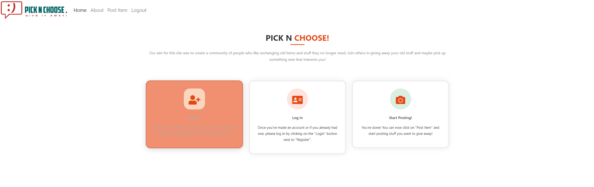
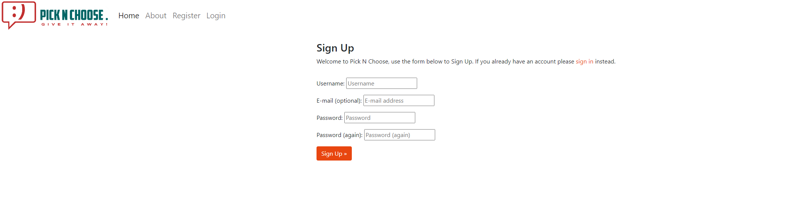
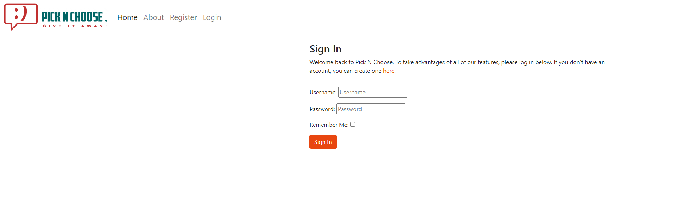
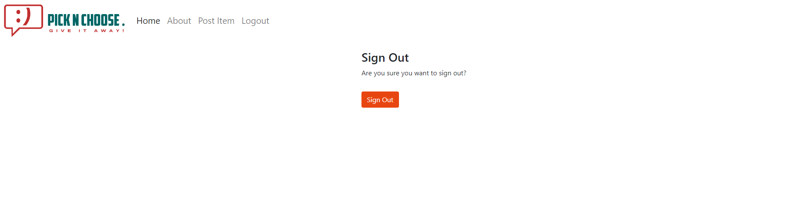
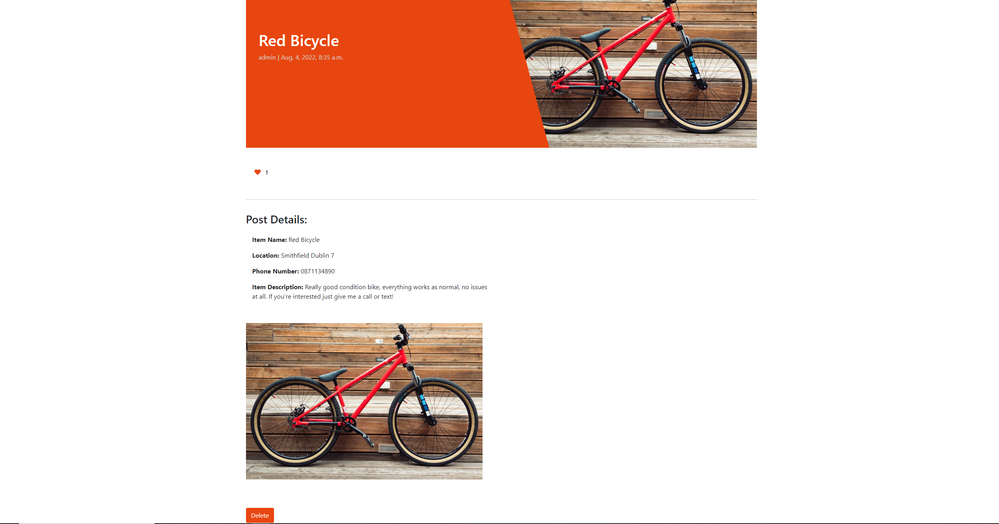
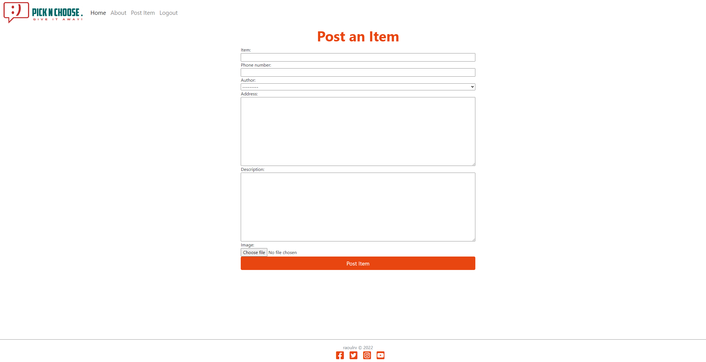
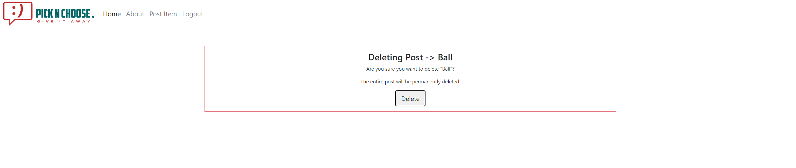

# PICK N CHOOSE
PICK N CHOOSE is a website that aims to bring together people who are looking to give away older items they have laying around. These items still have value yet often times you have to pay someone to take them away in a skip. 

The website is targeted towards users who wish to avoid paying fees to companies that come and dispose of their old stuff. 

By using the site users can post their items on the main page. Once the item is posted it will be available for other users to look at and decide if they're interested. All communication is intended to be made via telephone, the user will need to provide their phone number when posting the item.

Live link to [PICK N CHOOSE](https://pickandch.herokuapp.com/)

## TABLE OF CONTENTS
- [PICK N CHOOSE](#PICK-N-CHOOSE)
* [Design Idea](#design-idea)
    - [Colour Scheme](#colour-scheme)
    - [Wireframes](#wireframes)
    - [Images](#images)
    - [Fonts](#fonts)
* [Features](#features)
    + [Header](#header)
    + [Footer](#footer)
    + [Home Page](#home-page)
    + [About Page](#about-page)    
    + [Sign Up Page](#sign-up-page)
    + [Log In Page](#log-in-page)
    + [Log Out Page](#log-out-page)        
    + [Post Detail Page](#post-detail-page)
    + [Post Item Page](#post-item-page)
    + [Delete Post Page](#delete-post-page)
    + [Features Not Implemented](#features-not-implemented)

* [User Experience](#user-experience)
    + [User Stories](#user-stories)
    + [Design Idea](#design-idea)
      - [Colour Scheme](#colour-scheme)
      - [Wireframes](#wireframes)
      - [Images](#images)
      - [Fonts](#fonts)      

* [Agile](#agile)
  * [Data Model](#data-model)
  * [Testing](#testing)
    + [Manual Testing](#manual-testing)
    + [Validator Testing](#validator-testing)

* [Deployment To Heroku](#deployment---heroku)
* [Forking](#forking)
* [Cloning](#cloning)
* [Languages](#languages)
* [Technology Used](#technology-used)
* [Credits](#credits)
* [Acknowledgments](#acknowledgments)

## Features

### Header

- For the header I created a custom logo using a website called Looka, it was free and not that difficult to use.
- The custom logo is possitioned on the left side of the nav bar and top left side of the website. When clicking on the logo, the user will be returned back to the homepage.
- The navigation bar presents the user with 4 options at all times, however these options will change depending if the user is authenticated or not.
- Navigation bar is also present throughout every page on the website and it keeps all functionality on all pages.
- When using a mobile device or a smaller screen the navigation buttons will transform into a dropdown menu.
- In the header example above, the navigation buttons are presented to a non-authenticated user: Home, About, Register, Login.

- In this second header example we can see that the navigation buttons have changed, thats because the user is logged in and authenticated: Home, About, Post Item, Logout.

### Footer

- In the footer section I have included links to Facebook, Twitter, Instagram and Youtube as well as my github username and year.
- The icons are fully interractive and have feedback when you mouse over them.
- When clicking on the icons, the page will open in a new tab in order to not distract the user.

### Home Page

- As the main page of the website, our homepage includes everything the user needs to know and can easily deduce what the idea of the website is. This is due to simple design and minimalistic layout.
- The "Register" and "Login" buttons are available and easily readable.
- Homepage also contains every item posted by users.
- Each post card contains concise information such as the name of the item, user's name and where the user is located.
- You can also notice that each post shows the date it was created and the number of likes it received.
- Once the user has logged in, the buttons change to allow the user to Post Items and Log out.

### About Page

- When clicking on the About button, the user will be taken to the About page.
- On this page the user can read a brief but accurate description of the website and what its used for.
- Below the description there are 3 cards.
- Each card is interractive and will change color when hovered over.
- These cards contain 3 simple steps on how to Register, Log In and Start Posting.
- These instructions ensure that the user has an good experience when first accessing the website.

### Sign Up Page

- On the Sign Up page the user is presented with a form to fill out.
- This form includes: Username, Email, Password.
- Once the user has filled up these fields and clicked Sign Up he will be presented with a success message.
- Django allauth was used here.

### Log In Page

- On the Log In page the user is presented again with a form to fill out.
- This form includes: Username and Password and a tickbox for Remember me.
- Once he user has filled out the fields and clicked Sign in he will be presented with a sucess message.
- Django allauth was also used here.

### Log Out Page

- When clicking on the Logout button, the user is presented with a page.
- This page contains a question that makes sure the user really wants to sign out.
- When clicking on Sign out, the action is complete and user is logged out.

### Post Detail Page

- When the user clicks on a post on the home page, he is taken to post detail page in order to see more details about the item.
- This page contains the name of the item at the top of the page in big lettering, the name of the poster, and when the post was actually made.
- Below that we can see a heart which symbolizes the number of likes this post has received from different users.
- In the Post Details section we can see accurate details about the item including: Name, Location, Users Phone number and Item description.
- Below that there is a bigger picture of the item in question which will help the user better understand its condition.
- If the user is looking at his own post, he will be prestend with a Delete button if he desires to delete the post, for example if someone has already picked up the stuff hes giving away.
- If user is looking at someone else's post, the Delete button will say not available.

### Post Item Page

- When clicking on the Post Item button, the user is taken to the Post Item page.
- The page presents the user with a form to fill up for : item, phone number, author, address, description.
- This page also allows the user to upload an image to appear on their post.
- When everything is populated correctly the user will be able to click on Post Item and be presented with a success message if it goes through correctly.

### Delete Post Page

- When clicking on the Delete button at the bottom of the post details page, the user is taken to a Delete Post page.
- On this page the user is informed what hes trying to delete and then asked if he is sure he wants to delete the post permanently.
- When clicking the delete button the post will be delete and user will be taken back to the homepage.

### Features Not Implemented

- Searchbar on homepage
    - Due to lack of time I have yet to implement a search bar.
    - This search bar would sort through all the posts and return the user with his query based on title.
    - I plan on implementing this in the future.

- Comments
    - I have left out comments intentionally because my idea for this website was to have all communication done by contacting the poster via phone. That is how popular sites like DoneDeal operate as well.
    - I might consider adding comments if I get feedback on this issue.

- Edit button
    - This was left out due to time constraints, however I believe this doesn't affect the site functionality at all. 
    - If the user has given the item away, he can delete his post in order to stop being contacted. 
    - If the user has made a mistake when uploading his post, he can just delete it and upload again.