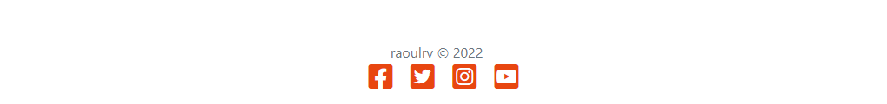
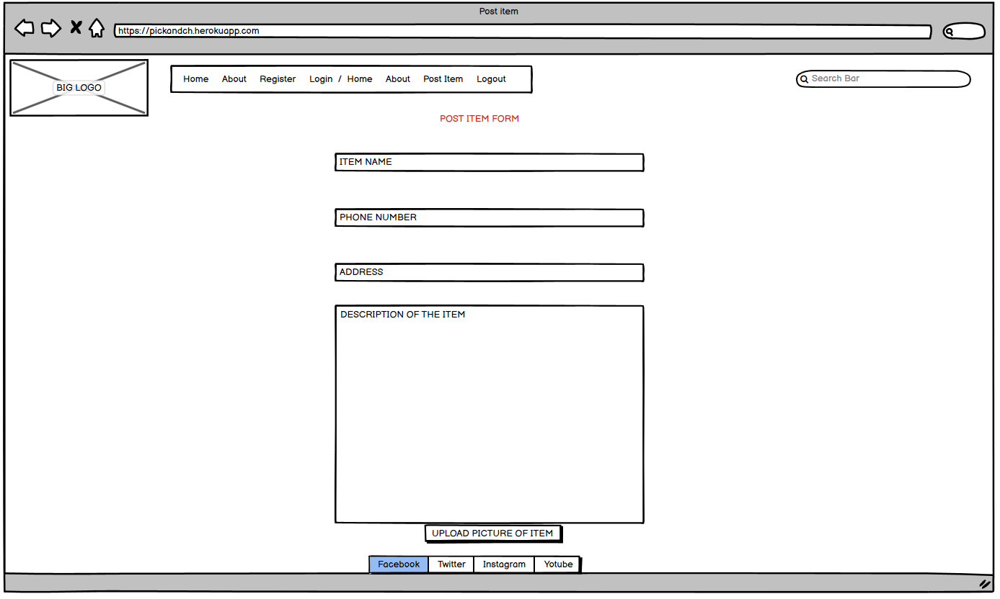

# PICK N CHOOSE

PICK N CHOOSE is a website that aims to bring together people who are looking to give away older items they have laying around. These items still have value yet often times you have to pay someone to take them away in a skip. 

The website is targeted towards users who wish to avoid paying fees to companies that come and dispose of their old stuff. 

By using the site users can post their items on the main page. Once the item is posted it will be available for other users to look at and decide if they're interested. All communication is intended to be made via telephone, the user will need to provide their phone number when posting the item.

Live link to [PICK N CHOOSE](https://pickandch.herokuapp.com/)

## TABLE OF CONTENTS
- [PICK N CHOOSE](#PICK-N-CHOOSE)
* [Design Idea](#design-idea)
    - [Colour Scheme](#colour-scheme)
    - [Wireframes](#wireframes)

* [Features](#features)
    + [Header](#header)
    + [Footer](#footer)
    + [Home Page](#home-page)
    + [About Page](#about-page)    
    + [Sign Up Page](#sign-up-page)
    + [Log In Page](#log-in-page)
    + [Log Out Page](#log-out-page)        
    + [Post Detail Page](#post-detail-page)
    + [Post Item Page](#post-item-page)
    + [Delete Post Page](#delete-post-page)
    + [Admin Page](#admin-page)
    + [Features Not Implemented](#features-not-implemented)

* [User Experience](#user-experience)
    + [User Stories](#user-stories)    

* [Agile](#agile)

* [Data Model](#data-model)
* [Testing](#testing)
    + [Manual Testing](#manual-testing)
    + [Validator Testing](#validator-testing)

* [Deployment To Heroku](#deployment-to-heroku)
* [Technology Used](#technology-used)
* [Credits](#credits)

## Features

### Header

- For the header I created a custom logo using a website called Looka, it was free and not that difficult to use.
- The custom logo is positioned on the left side of the nav bar and top left side of the website. When clicking on the logo, the user will be returned back to the homepage.
- The navigation bar presents the user with 4 options at all times, however these options will change depending if the user is authenticated or not.
- Navigation bar is also present throughout every page on the website and it keeps all functionality on all pages.
- When using a mobile device or a smaller screen the navigation buttons will transform into a dropdown menu.
- In the header example above, the navigation buttons are presented to a non-authenticated user: Home, About, Register, Login.

- In this second header example we can see that the navigation buttons have changed, that's because the user is logged in and authenticated: Home, About, Post Item, Logout.

### Footer

- In the footer section I have included links to Facebook, Twitter, Instagram and Youtube as well as my github username and year.
- The icons are fully interactive and have feedback when you mouse over them.
- When clicking on the icons, the page will open in a new tab in order to not distract the user.

### Home Page

- As the main page of the website, our homepage includes everything the user needs to know and can easily deduce what the idea of the website is. This is due to simple design and minimalistic layout.
- The "Register" and "Login" buttons are available and easily readable.
- Homepage also contains every item posted by users.
- Each post card contains concise information such as the name of the item, user's name and where the user is located.
- You can also notice that each post shows the date it was created and the number of likes it received.
- Once the user has logged in, the buttons change to allow the user to Post Items and Log out.

### About Page

- When clicking on the About button, the user will be taken to the About page.
- On this page the user can read a brief but accurate description of the website and what its used for.
- Below the description there are 3 cards.
- Each card is interactive and will change color when hovered over.
- These cards contain 3 simple steps on how to Register, Log In and Start Posting.
- These instructions ensure that the user has a good experience when first accessing the website.

### Sign Up Page

- On the Sign Up page the user is presented with a form to fill out.
- This form includes: Username, Email, Password.
- Once the user has filled up these fields and clicked Sign Up he will be presented with a success message.
- Django allauth was used here.

### Log In Page

- On the Log In page the user is presented again with a form to fill out.
- This form includes: Username and Password and a tickbox for Remember me.
- Once he user has filled out the fields and clicked Sign in he will be presented with a success message.
- Django allauth was also used here.

### Log Out Page

- When clicking on the Logout button, the user is presented with a page.
- This page contains a question that makes sure the user really wants to sign out.
- When clicking on Sign out, the action is complete and user is logged out.

### Post Detail Page

- When the user clicks on a post on the home page, he is taken to post detail page in order to see more details about the item.
- This page contains the name of the item at the top of the page in big lettering, the name of the poster, and when the post was actually made.
- Below that we can see a heart which symbolizes the number of likes this post has received from different users.
- In the Post Details section we can see accurate details about the item including: Name, Location, Users Phone number and Item description.
- Below that there is a bigger picture of the item in question which will help the user better understand its condition.
- If the user is looking at his own post, he will be presented with a Delete button if he desires to delete the post, for example if someone has already picked up the stuff hes giving away.
- If user is looking at someone else's post, the Delete button will say not available.

### Post Item Page

- When clicking on the Post Item button, the user is taken to the Post Item page.
- The page presents the user with a form to fill up for : item, phone number, author, address, description.
- This page also allows the user to upload an image to appear on their post.
- When everything is populated correctly the user will be able to click on Post Item and be presented with a success message if it goes through correctly.

### Delete Post Page

- When clicking on the Delete button at the bottom of the post details page, the user is taken to a Delete Post page.
- On this page the user is informed what hes trying to delete and then asked if he is sure he wants to delete the post permanently.
- When clicking the delete button the post will be delete and user will be taken back to the homepage.

### Admin Page

- Admin page has all the functionality required to run the website.
- This includes full CRUD functionality and power over registered users.
- Admin Post page also includes Summernote.

### Features Not Implemented

- Searchbar on homepage
    - Due to lack of time I have yet to implement a search bar.
    - This search bar would sort through all the posts and return the user with his query based on title.
    - I plan on implementing this in the future.

- Comments
    - I have left out comments intentionally because my idea for this website was to have all communication done by contacting the poster via phone. That is how popular sites like DoneDeal operate as well.
    - I might consider adding comments if I get feedback on this issue.

- Edit button
    - This was left out due to time constraints, however I believe this doesn't affect the site functionality at all. 
    - If the user has given the item away, he can delete his post in order to stop being contacted. 
    - If the user has made a mistake when uploading his post, he can just delete it and upload again.

## Design Idea

The site design was meant to be as simple and minimalistic as possible. This was done with the clear intention to make the users life easier. The user should be able to access the website and figure out what everything does, regardless of their age or computer knowledge, there is no clutter to confuse them.

### Colour Scheme

The main colors of the website are Flame and White/Cultured. This was done to create a contrast between the bright orange and white background. Grey/Dark Liver was also used for the same purpose to make sure everything is readable.

### Wireframes

In the design phase of the website I used Balsamiq to create wireframes in order to get an idea how the site will look.

## User Experience

The site was designed to be easy and intuitive to use.
A user for our site would have to be an adult that wishes to get rid of old items but he knows they still have value and doesn't want to throw them away. The user should also like to check whats already posted on the site by others, similar to a flea market.

### User Stories
- User Stories Implemented
    - View post list: As a Site User I can view a list of posts so that I can select one to read
    - Open a post: As a Site User I can click on a post so that I can check the item description
    - View likes: As a Site User / Admin I can view the number of likes - on each post so that I can see which is the most popular or viral
    - Account registration: As a Site User I can register an account so that I can post and like
    - Like / Unlike: As a Site User I can like or unlike a post so that I can interact with the content
    - Manage posts: As a Site Admin I can create, read, update and delete posts so that I can manage my sites content
    - Create drafts: As a Site Admin I can create draft posts so that I can finish writing the content later
    - View Address: As a Site User I can see the pick-up address on the main page without clicking on individual posts so that I don't waste any time
    - Pagination: As a Site User I can view a paginated list of items so that I can select which one I want to view
    - Phone Number: As a user I can click on each post and see the posters phone number so that I can contact them about the item
    - Big picture: As a user I can click on each post and see a bigger picture of the item so that I can check its condition
    - Post Item: As a user I can post an item on the website so that I can give it away
    - Delete a post: As a user I can delete a post I have made so that I can remove it when the item has been given away

- User Stories not yet implemented

    - Search Bar: As a user I can click on the searchbar and type the title of the post I'm looking for so that I can find what I'm interested in.

        - This was left out due to time constraints, however I will be adding this the next time I have some free time as its a core functionality of my site.

    - Comment on a post: As a Site User I can leave comments on a post so that I can be involved in the conversation

        - This wasn't implemented on purpose because I intended the website communication to be done via phone, that's why the phone number is provided by the poster.

    - Approve comments: As a Site Admin I can approve or disapprove comments so that I can filter out objectionable comments

        - Same reason as the "Comment on a post" story.

## Agile

In order to complete this project I have used the Agile Methodology.
This involves breaking down the project into smaller tasks called User Stories. These user stories were added using githubs Issues functionality.
Each user story was made into an issue and added to the projects kanban board. After each user story was coded into the websites functionality I would move the issue from "To Do" Column into "In Progress" and eventually into "Done" column depending what stage of development it was.

- You can see the live kanban board with all the user stories by [clicking here.](https://github.com/users/RaoulRV/projects/2/views/1)

## Data Model

I created a diagram in order to help me figure out how my model will look like. Once the diagram was completed I went ahead and created a custom model named Post.

## Testing

I have conducted thorough testing of the website, as well as some close friends who I have instructed to test the site.

I have also included these results separately [right here](https://github.com/RaoulRV/picknch/blob/main/static/testing.md)

## User Story testing

Issue No. | Title | Acceptance criteria | Testing carried out
----------|-------|---------------------|-------------------------
#01 | Manage posts | Admin can create, update or remove posts | Ensured that the admin user has full functionality of the create/delete/edit buttons by creating and deleting posts multiple times
#02 | Account registration | Easy registration process and login/logout process | Manually tested the registration form several times to ensure it works properly as well as logged in and logged out many times
#03|  Create post | The registered users can create posts pending approval from admin user | Ensure the creating, editing, viewing and deleting post is appropriately processed and that the procedures are straight forward. Restrict the editing and deleting post process to user's own entry only except for superusers
#04 | Create Drafts | Admin can create drafts that dont appear on the home page | Manually tested the draft dropdown menu and posted multiple drafts , also made sure they are not appearing outside of the django admin page.
#05 | Site pagination | User can select each item to view and change pages | Created multiple user profiles and multiple posts in order to check if everything works, also clicked the "Next" button to make sure it goes to next page
#06 | View Address | User can see posters address on main page | Made multiple posts and logged out to ensure I can still see the address for each post
#07 | View post list | All site visitor users can view the post list | Making sure every single post is visible on the home page to every user regardless if hes logged in or not, also making sure posts with draft status aren't visible. 
#08 | Open a post | Every user can open an individual post and view the contents inside but not interact with the post | Ensured the post details are available to everyone that clicks on the individual post, tested the link that opens post and it never failed, also made sure non-authenticated users cannot interact with the post at all
#09 | Phone Number | Every user can click on post details and see posters phone number | Created multiple user profiles and multiple posts where I added my number then logged out to make sure any non-authenticated or authenticated user can see the phone number
#10 | Big picture | A good sized picture of the item visible in post details | Manually added multiple posts and uploaded many different images to make sure they are properly displayed in the post details page, also checked if they are responsive
#11 | Delete a post | Authenticated user can delete his own posts but no one else's | Manually created multiple users and made a single post for each, then i logged in to different accounts to make sure a user can only delete his own post
#12 | Like/Unlike | Likes are visible to everyone but only registered users can interact with the button | Made sure I cannot use the like button while logged out, tested if it worked while i was logged in and checked to see if I can remove a like aswell as add a like to a post
#13 | View Likes | Likes properly saved and displayed on the homepage/post details | Liked and unliked manually on different user profiles and refreshed many times to see if they displayed properly on both pages
#14 | Searchbar | Not implemented | No tests
#15 | Comment | Not implemented | No tests
#16 | Approve Comments| Not implemented | No tests

## Manual Testing 

| Feature| Acceptance Criteria | Tests Carried out | Result |  
| --- | --- | --- | --- | 
| Admin CRUD | Admin account can create/update/delete posts | Created admin account, logged in and clicked every button for create,update or delete| Pass |
| Admin restricted access | Access to admin page is not available to normal users | Created a normal user and attempted to log into the admin page | Pass |
| Non Authenticated user/like  | Like button is visible but not activated/interactable | Logged out and refreshed the page to test if I can use the like button | Pass |  
| Non Authenticated user/create  | Post Item option is not visible if you're logged out|Logged out and refreshed the page many times, clicked on different pages of the website to check if Post Item is visible| Pass | 
| Registration/ left blank |A message appearing that says "fill out this field"| Attempted to create an account with fields left blank or adding a space and then clicking sign up| Pass | 
| Registration/ bad email| A message appearing that instructs you about email address format| Tried creating an account by using random letters and numbers, also by not finishing the address after "@"| Pass | 
| Registration/ Common Password |A message appearing that instructs you the password is too common| Added a password that was very simple and easy to guess such as "password"| Pass | 
| Registration/ Short Password |A message appearing that says your password is too short and it must contain 8 characters | Created account and added password "123"| Pass | 
| Login/ Blank Field | A message instructing you to fill out this field|Attempted to log in without filling up the username field | Pass | 
|Login/ Incorrect Username|A message that says "username or password you specified are not correct"|Tried logging in with random letters and numbers in the username field| Pass |
|Login/ Incorrect Password| A message that says "username or password you specified are not correct"|Tried logging in with random letters and numbers in the password field| Pass |
|Logged in/ like  | Like button is visible and active| Created a new user, logged in and clicked on the like button to see if I can interact with it| Pass | 
|Logged in/ Post Item  |Post Item button is visible in navigation bar|Created a new user and logged in, checked in the top left to see if Post Item was there, also clicked on it| Pass | 
|Post Item/ no image |The placeholder image should take its place| Created a new account and logged in, created a new post but didn't upload a picture and refreshed to check the homepage | Pass |
|Post Item/ Blank Fields |Not allowed to post if required fields are empty| Logged in and pressed on Post Item button, left every field empty and pressed on Post| Pass |
| Delete/ not author |Button should say "Delete not available"|Logged in on admin, created a post and then logged out and into another account. Checked the post I created previously and the delete button| Pass |
| Delete/ author |Delete button should be available and visible|Created a post on an account and then refreshed the homepage, clicked on the post and scrolled down to see the delete button| Pass | 
| Delete page|Page should pop up asking if you're sure you want to delete|Clicked on my own post, scrolled down and clicked the delete button| Pass |
|Message/ login | Message appears confirming successful login |Logged in on an account| Pass |
|Logout Page |Page pops up asking the user to confirm logout| Clicked on log out button| Pass |
|Message/ logout |Message appears confirming successful logout|Clicked on the log out button and then again on log out| Pass |
|Message/ Post Item|Message appears confirming your successful post| Clicked on post item and filled out the form, then clicked on post| Pass |
|Pagination|Next button appears on the bottom of the page and its clickable|Scrolled down and clicked on next button| Pass |
|Footer Socials|Social icons appear in the footer and open their pages in a new tab| Clicked on the social icons on the bottom of the page| Pass |

## Validator Testing

### CSS Validator
I ran the CSS code through W3C Validator and returned no errors:

### HTML Validator
I ran the entire website through HTML Validator as well and returned no errors:

### Pep8 Validator
I also ran all of the python code through Pep8 validator and returned no errors:

## Deployment To Heroku

I've used Heroku to host my website and in the following steps I will be describing how to deploy your project to Heroku as well;

- 1. Access https://www.heroku.com
- 2. Create an account and log in.
- 3. You will be directed to your dashboard once logged in.
- 4. Click on the button called "New" in the top right corner of the screen.
- 5. Click on Create new app from the drop down menu.
- 6. Choose an App Name and choose a region that's closest to your location, then click Create app.
- 7. Click on Settings and then click on "Config Vars"
- 8. After clicking on "Reveal Config Vars" please copy the following configuration:
    - CLOUDINARY_URL : < your cloudinary id goes here >
    - DATABASE_URL : < your postgres database key goes here>
    - SECRET_KEY = < the secret key you add her will need to be added in the settings.py file as well>
    - PORT : 8000
    - DISABLE_COLLECTSTATIC = 1 (remove this before final deployment)
- 9. In the "Buildpacks" field, click on the Add buildpack button.
- 10. Choose /herokupython and then save.
- 11. Click on the deploy tab at the top of the page.
- 12. In the deployment method choose github and then log in with your github account.
- 13. Choose which repository you want to deploy.
- 14. Scroll down and click the Deploy button.
- 15. Done!

## Technology Used

- HTML5
- CSS3
- Python
- Django
- Cloudinary
- Bootstrap
- FontAwesome
- Google Fonts
- GitPod
- GitHub
- DevTools
- Heroku
- Balsamiq
- PostgreSQL
- Allauth
- Summernote

## Credits
- Looka - Created custom logo
- "Hello Django" and "I think therefore I blog" - Structure of this project is mainly based on those 2 lessons
- Previous projects done by Code Institute students - Also a big source of inspiration
- Pictures uploaded on my website are from https://www.google.com/
- About page code is taken from https://www.codepen.io
- Code Institute Tutor Team - They were a huge help and I couldn't complete this project without them.

    
